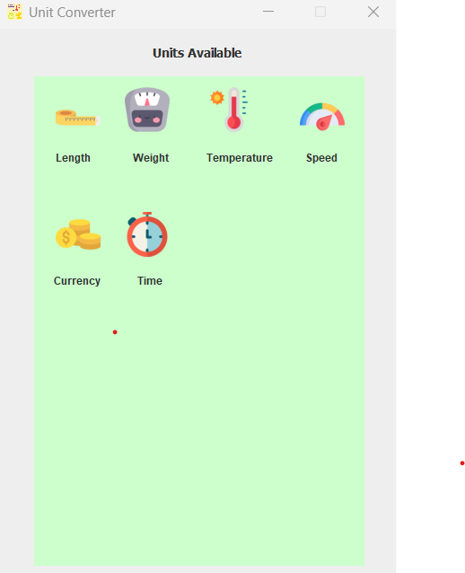
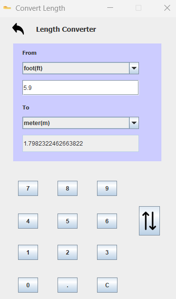
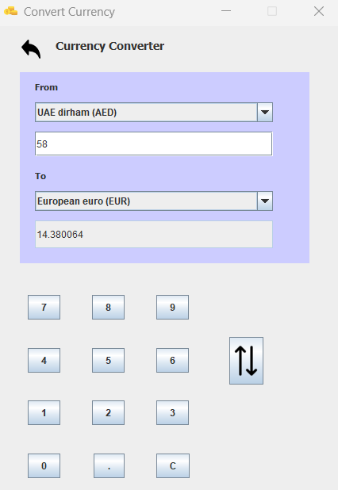

# UnitConverter
Windows app that allows users to perform several unit conversions including foreign currency conversion.

For fetching live global currency rates, the api used is provided by: https://api.exchangerate.host/

Main app screen:
  

Unit conversion:
  

Currency conversion:
  
